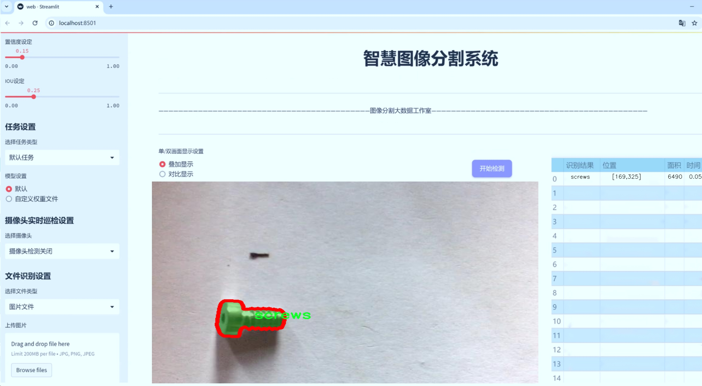
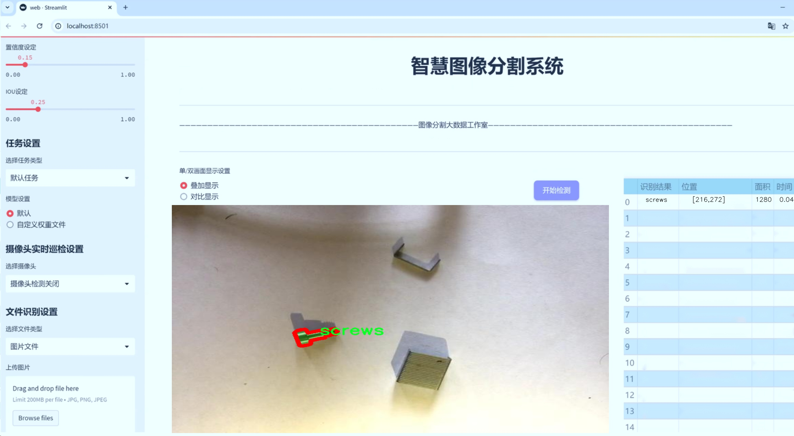
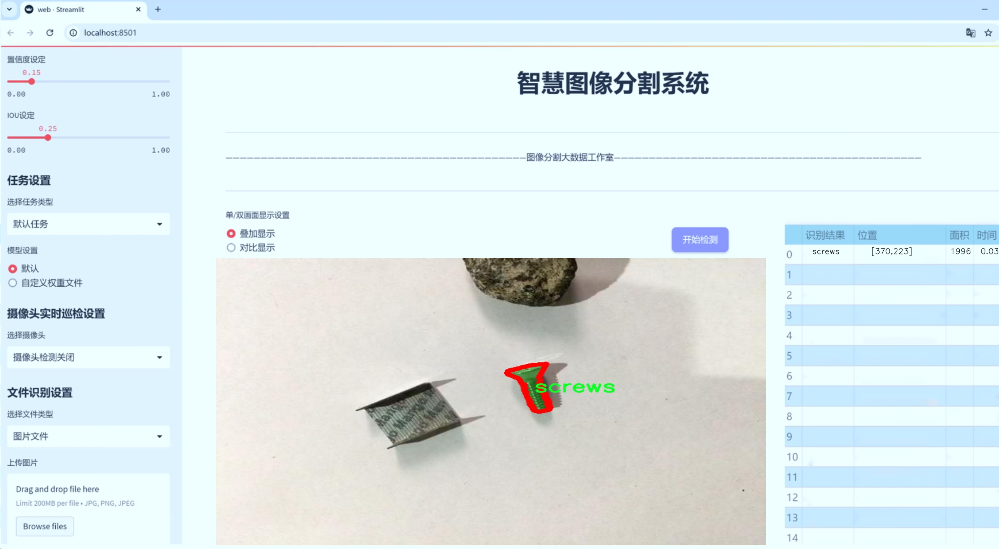
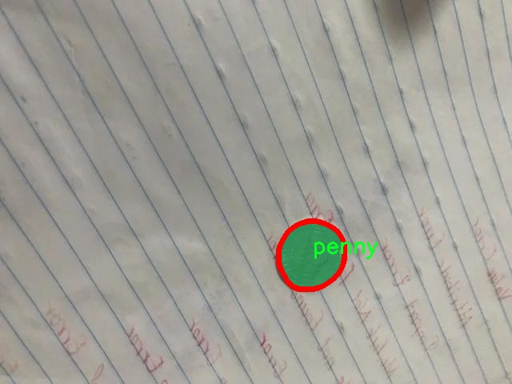
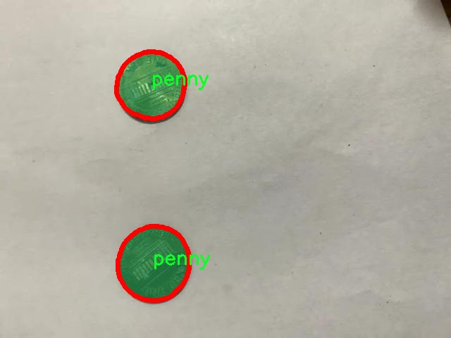
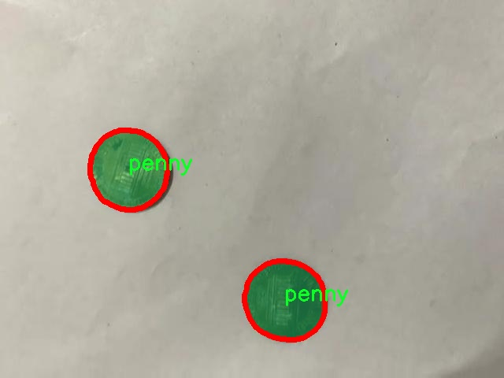
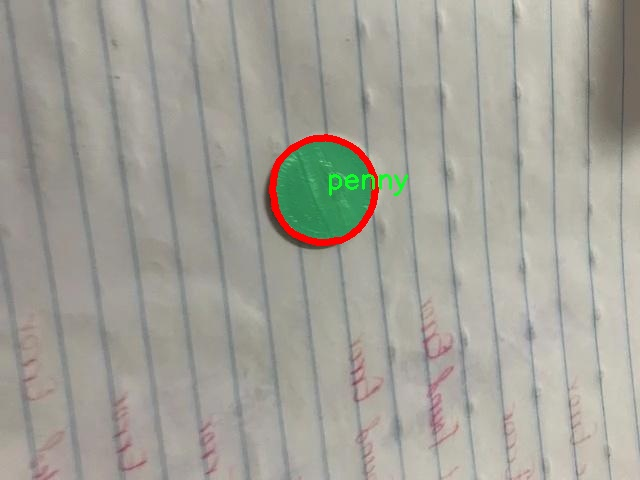
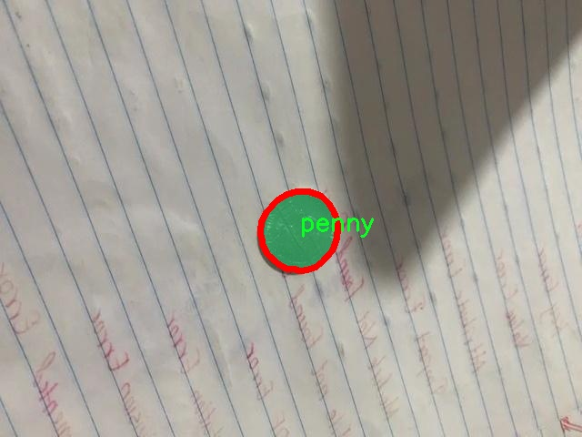

# 螺丝和配件分割系统： yolov8-seg-C2f-CloAtt

### 1.研究背景与意义

[参考博客](https://gitee.com/YOLOv8_YOLOv11_Segmentation_Studio/projects)

[博客来源](https://kdocs.cn/l/cszuIiCKVNis)

研究背景与意义

随着工业自动化和智能制造的迅速发展，螺丝和配件的自动化识别与分割技术在生产线上的应用变得愈发重要。螺丝、垫圈等小型配件在现代制造业中扮演着不可或缺的角色，尤其是在汽车、电子和机械制造等领域。传统的人工分拣和识别方法不仅效率低下，而且容易出现误差，影响生产效率和产品质量。因此，基于计算机视觉的自动化分割系统应运而生，成为提升生产效率和降低人力成本的重要手段。

在众多计算机视觉技术中，YOLO（You Only Look Once）系列模型因其高效的实时目标检测能力而备受关注。YOLOv8作为该系列的最新版本，结合了深度学习和卷积神经网络的优势，能够在保证高精度的同时实现快速的推理速度。通过对YOLOv8模型的改进，能够更好地适应螺丝和配件的特征，提升其在复杂背景下的分割性能。这一研究不仅有助于提高螺丝和配件的识别精度，还能在多种工业应用场景中实现实时监控和智能分拣。

本研究基于“screw-penny-nuts”数据集，该数据集包含4000张图像，涵盖了三类物体：便士、螺丝和垫圈。这些图像为模型的训练和测试提供了丰富的样本，使得模型能够学习到不同物体的特征和形状变化。通过对这些图像进行实例分割，模型能够精确地识别和分离出不同类别的物体，为后续的自动化分拣提供可靠的数据支持。

在当前的研究背景下，基于改进YOLOv8的螺丝和配件分割系统具有重要的理论和实际意义。首先，从理论层面来看，该研究将推动计算机视觉和深度学习领域的发展，尤其是在实例分割技术的应用方面。通过对YOLOv8模型的改进，研究者可以探索新的网络架构和训练策略，为未来的研究提供借鉴和参考。

其次，从实际应用层面来看，基于该分割系统的工业自动化解决方案将显著提高生产效率和产品质量。通过实现对螺丝和配件的快速、准确识别，企业可以减少人工干预，降低人力成本，同时提高生产线的智能化水平。此外，该系统还可以扩展到其他小型物体的识别与分割，为不同领域的自动化应用提供技术支持。

综上所述，基于改进YOLOv8的螺丝和配件分割系统的研究不仅具有重要的学术价值，也为工业界提供了切实可行的解决方案。随着技术的不断进步和应用场景的不断拓展，该研究将为推动智能制造的发展做出积极贡献。

### 2.图片演示







注意：本项目提供完整的训练源码数据集和训练教程,由于此博客编辑较早,暂不提供权重文件（best.pt）,需要按照6.训练教程进行训练后实现上图效果。

### 3.视频演示

[3.1 视频演示](https://www.bilibili.com/video/BV1hJmXYoEec/)

### 4.数据集信息

##### 4.1 数据集类别数＆类别名

nc: 3
names: ['penny', 'screws', 'washer']


##### 4.2 数据集信息简介

数据集信息展示

在现代计算机视觉领域，数据集的构建与选择对于模型的训练和性能优化至关重要。本研究所使用的数据集名为“screw-penny-nuts”，旨在为改进YOLOv8-seg的螺丝和配件分割系统提供强有力的支持。该数据集专注于三种特定类别的物体，分别是“penny”（便士）、“screws”（螺丝）和“washer”（垫圈），总计包含三类物体（nc: 3）。这些类别的选择不仅反映了工业和日常生活中常见的紧固件和配件，还为目标检测和分割任务提供了丰富的场景。

在数据集的构建过程中，研究团队精心挑选了各种不同形状、尺寸和颜色的便士、螺丝和垫圈，以确保数据的多样性和代表性。这种多样性对于训练深度学习模型至关重要，因为它能够帮助模型学习到不同物体在不同条件下的特征表现，从而提高其在实际应用中的泛化能力。数据集中包含的图像不仅涵盖了不同的拍摄角度和光照条件，还考虑了背景的多样性，以模拟真实世界中的复杂场景。

为了确保数据集的高质量，所有图像都经过严格的标注和审核。每个类别的物体在图像中都被精确地框定，并附上相应的标签。这种精细的标注过程不仅提高了数据集的准确性，也为后续的模型训练提供了可靠的基础。研究团队采用了先进的图像处理技术，以增强图像的清晰度和对比度，从而进一步提升模型的训练效果。

在模型训练阶段，数据集“screw-penny-nuts”将被用于YOLOv8-seg的训练和验证。YOLOv8-seg作为一种先进的目标检测与分割模型，能够在保持高精度的同时实现实时处理。通过利用该数据集，模型将能够学习到如何在复杂背景中准确识别和分割出便士、螺丝和垫圈等物体。这一过程不仅涉及到物体的边界检测，还包括对物体形状和纹理的深入理解，从而实现更为精细的分割效果。

此外，数据集的设计还考虑到了不同应用场景的需求。例如，在工业自动化领域，螺丝和配件的快速识别与分割对于生产线的效率提升至关重要；而在日常生活中，便士的识别则可能应用于智能支付系统或自动售货机中。因此，数据集“screw-penny-nuts”不仅具备学术研究的价值，也具有广泛的实际应用潜力。

总之，数据集“screw-penny-nuts”通过精心的设计和构建，为改进YOLOv8-seg的螺丝和配件分割系统提供了坚实的基础。其多样化的样本、精确的标注以及丰富的应用场景，使得该数据集在推动计算机视觉技术进步的同时，也为相关领域的研究和应用提供了重要的支持。随着模型的不断优化和应用场景的扩展，未来该数据集有望在更广泛的领域中发挥其独特的价值。











### 5.项目依赖环境部署教程（零基础手把手教学）

[5.1 环境部署教程链接（零基础手把手教学）](https://www.bilibili.com/video/BV1jG4Ve4E9t/?vd_source=bc9aec86d164b67a7004b996143742dc)


[5.2 安装Python虚拟环境创建和依赖库安装视频教程链接（零基础手把手教学）](https://www.bilibili.com/video/BV1nA4VeYEze/?vd_source=bc9aec86d164b67a7004b996143742dc)

### 6.手把手YOLOV8-seg训练视频教程（零基础手把手教学）

[6.1 手把手YOLOV8-seg训练视频教程（零基础小白有手就能学会）](https://www.bilibili.com/video/BV1cA4VeYETe/?vd_source=bc9aec86d164b67a7004b996143742dc)


按照上面的训练视频教程链接加载项目提供的数据集，运行train.py即可开始训练



     Epoch   gpu_mem       box       obj       cls    labels  img_size
     1/200     0G   0.01576   0.01955  0.007536        22      1280: 100%|██████████| 849/849 [14:42<00:00,  1.04s/it]
               Class     Images     Labels          P          R     mAP@.5 mAP@.5:.95: 100%|██████████| 213/213 [01:14<00:00,  2.87it/s]
                 all       3395      17314      0.994      0.957      0.0957      0.0843

     Epoch   gpu_mem       box       obj       cls    labels  img_size
     2/200     0G   0.01578   0.01923  0.007006        22      1280: 100%|██████████| 849/849 [14:44<00:00,  1.04s/it]
               Class     Images     Labels          P          R     mAP@.5 mAP@.5:.95: 100%|██████████| 213/213 [01:12<00:00,  2.95it/s]
                 all       3395      17314      0.996      0.956      0.0957      0.0845

     Epoch   gpu_mem       box       obj       cls    labels  img_size
     3/200     0G   0.01561    0.0191  0.006895        27      1280: 100%|██████████| 849/849 [10:56<00:00,  1.29it/s]
               Class     Images     Labels          P          R     mAP@.5 mAP@.5:.95: 100%|███████   | 187/213 [00:52<00:00,  4.04it/s]
                 all       3395      17314      0.996      0.957      0.0957      0.0845


### 7.50+种全套YOLOV8-seg创新点加载调参实验视频教程（一键加载写好的改进模型的配置文件）

[7.1 50+种全套YOLOV8-seg创新点加载调参实验视频教程（一键加载写好的改进模型的配置文件）](https://www.bilibili.com/video/BV1Hw4VePEXv/?vd_source=bc9aec86d164b67a7004b996143742dc)

### YOLOV8-seg算法简介

原始YOLOv8-seg算法原理

YOLOv8-seg算法是Ultralytics团队在2023年推出的最新版本目标检测与分割算法，它在YOLO系列的基础上进行了多项重要的改进，旨在提升目标检测的精度和速度，同时增强模型的灵活性和实用性。YOLOv8-seg不仅继承了YOLOv5的优良特性，还结合了YOLOv7的创新思想，形成了一种更为高效的目标检测与分割解决方案。

首先，YOLOv8-seg在输入图像的处理上进行了优化。与传统的图像处理方法不同，YOLOv8-seg在训练阶段采用了Mosaic数据增强技术，通过将四张不同的图像随机缩放并拼接成一张新图像，从而增加了训练样本的多样性。这种方法有效地提升了模型的鲁棒性和泛化能力。然而，考虑到Mosaic增强可能会影响数据的真实分布，YOLOv8-seg在训练的最后10个epoch中停止使用该增强技术，以确保模型能够更好地学习到真实数据的特征。

在网络结构方面，YOLOv8-seg的主干网络采用了C2f模块替代了YOLOv5中的C3模块。C2f模块的设计灵感来源于YOLOv7中的ELAN结构，它通过引入更多的跳层连接，增强了梯度流的传递，确保了信息的丰富性与流动性。这种改进不仅提高了模型的精度，还在保持轻量化的同时，降低了计算的复杂度。此外，YOLOv8-seg依然保留了SPPF（Spatial Pyramid Pooling Fast）模块，以优化特征提取的效率。

在颈部网络的设计上，YOLOv8-seg同样将所有的C3模块更改为C2f模块，并且去除了两处上采样之前的卷积连接层。这一设计的核心在于简化网络结构，减少不必要的计算，同时保持特征信息的完整性。通过直接对Backbone不同阶段输出的特征进行上采样，YOLOv8-seg能够更有效地整合多层次的特征信息，从而提升目标检测的准确性。

YOLOv8-seg在头部网络的设计上进行了重大创新，采用了解耦头（Decoupled Head）结构。与YOLOv5的耦合头不同，YOLOv8-seg的解耦头将分类和定位任务分为两个独立的分支，分别提取类别和位置特征。这种结构的设计使得模型在进行分类时能够更专注于特征图中的相似性分析，而在进行定位时则更关注边界框与真实框之间的关系。这种分离的处理方式有效地提高了模型的收敛速度和预测精度。

在损失函数的设计上，YOLOv8-seg也做出了相应的调整。为了应对训练和推理过程中存在的逻辑不一致性，YOLOv8-seg取消了传统的对象分支（Obj branch），而是在分类分支中继续使用二元交叉熵损失（BCELoss），在边界框回归分支中则引入了分布焦点损失（DFL）和CIoU损失。这种设计旨在使网络能够快速聚焦于标签附近的数值，从而提高模型的定位精度。

YOLOv8-seg的另一大亮点在于其采用了无锚框（Anchor-Free）的方法。这一方法摒弃了传统的基于锚框的检测方式，直接将目标检测转化为关键点检测。这种转变使得YOLOv8-seg在处理不同尺度和形状的目标时，具备了更强的灵活性和适应性。同时，无锚框的设计也简化了网络结构，降低了计算复杂度，使得模型在推理时更加高效。

在性能评估方面，YOLOv8-seg在COCO数据集上的表现优异，展现了其在精度和速度上的优势。通过与其他YOLO系列模型的对比，YOLOv8-seg在相同模型尺寸下实现了更高的mAP（mean Average Precision）和更快的推理速度，充分证明了其在目标检测与分割任务中的有效性。

综上所述，YOLOv8-seg算法通过对输入处理、网络结构、损失函数及检测方法的多方面优化，形成了一种高效、准确且灵活的目标检测与分割解决方案。其在实际应用中的广泛适用性，使得YOLOv8-seg成为了当前计算机视觉领域中一项具有重要研究和应用价值的技术。随着对YOLOv8-seg的深入研究与应用，未来有望在智能监控、自动驾驶、医疗影像分析等多个领域发挥更大的作用。


### 9.系统功能展示（检测对象为举例，实际内容以本项目数据集为准）

图9.1.系统支持检测结果表格显示

  图9.2.系统支持置信度和IOU阈值手动调节

  图9.3.系统支持自定义加载权重文件best.pt(需要你通过步骤5中训练获得)

  图9.4.系统支持摄像头实时识别

  图9.5.系统支持图片识别

  图9.6.系统支持视频识别

  图9.7.系统支持识别结果文件自动保存

  图9.8.系统支持Excel导出检测结果数据


### 10.50+种全套YOLOV8-seg创新点原理讲解（非科班也可以轻松写刊发刊，V11版本正在科研待更新）

#### 10.1 由于篇幅限制，每个创新点的具体原理讲解就不一一展开，具体见下列网址中的创新点对应子项目的技术原理博客网址【Blog】：


[10.1 50+种全套YOLOV8-seg创新点原理讲解链接](https://gitee.com/qunmasj/good)

#### 10.2 部分改进模块原理讲解(完整的改进原理见上图和技术博客链接)【如果此小节的图加载失败可以通过CSDN或者Github搜索该博客的标题访问原始博客，原始博客图片显示正常】

### Gold-YOLO简介
YOLO再升级：华为诺亚提出Gold-YOLO，聚集-分发机制打造新SOTA
在过去的几年中，YOLO系列模型已经成为实时目标检测领域的领先方法。许多研究通过修改架构、增加数据和设计新的损失函数，将基线推向了更高的水平。然而以前的模型仍然存在信息融合问题，尽管特征金字塔网络（FPN）和路径聚合网络（PANet）已经在一定程度上缓解了这个问题。因此，本研究提出了一种先进的聚集和分发机制（GD机制），该机制通过卷积和自注意力操作实现。这种新设计的模型被称为Gold-YOLO，它提升了多尺度特征融合能力，在所有模型尺度上实现了延迟和准确性的理想平衡。此外，本文首次在YOLO系列中实现了MAE风格的预训练，使得YOLO系列模型能够从无监督预训练中受益。Gold-YOLO-N在COCO val2017数据集上实现了出色的39.9% AP，并在T4 GPU上实现了1030 FPS，超过了之前的SOTA模型YOLOv6-3.0-N，其FPS相似，但性能提升了2.4%。


#### Gold-YOLO


YOLO系列的中间层结构采用了传统的FPN结构，其中包含多个分支用于多尺度特征融合。然而，它只充分融合来自相邻级别的特征，对于其他层次的信息只能间接地进行“递归”获取。

传统的FPN结构在信息传输过程中存在丢失大量信息的问题。这是因为层之间的信息交互仅限于中间层选择的信息，未被选择的信息在传输过程中被丢弃。这种情况导致某个Level的信息只能充分辅助相邻层，而对其他全局层的帮助较弱。因此，整体上信息融合的有效性可能受到限制。
为了避免在传输过程中丢失信息，本文采用了一种新颖的“聚集和分发”机制（GD），放弃了原始的递归方法。该机制使用一个统一的模块来收集和融合所有Level的信息，并将其分发到不同的Level。通过这种方式，作者不仅避免了传统FPN结构固有的信息丢失问题，还增强了中间层的部分信息融合能力，而且并没有显著增加延迟。


# 8.低阶聚合和分发分支 Low-stage gather-and-distribute branch
从主干网络中选择输出的B2、B3、B4、B5特征进行融合，以获取保留小目标信息的高分辨率特征。


低阶特征对齐模块 (Low-stage feature alignment module)： 在低阶特征对齐模块（Low-FAM）中，采用平均池化（AvgPool）操作对输入特征进行下采样，以实现统一的大小。通过将特征调整为组中最小的特征大小（ R B 4 = 1 / 4 R ） （R_{B4} = 1/4R）（R 
B4 =1/4R），我们得到对齐后的特征F a l i g n F_{align}F align 。低阶特征对齐技术确保了信息的高效聚合，同时通过变换器模块来最小化后续处理的计算复杂性。其中选择 R B 4 R_{B4}R B4 作为特征对齐的目标大小主要基于保留更多的低层信息的同时不会带来较大的计算延迟。
低阶信息融合模块(Low-stage information fusion module)： 低阶信息融合模块（Low-IFM）设计包括多层重新参数化卷积块（RepBlock）和分裂操作。具体而言，RepBlock以F a l i g n ( c h a n n e l = s u m ( C B 2 ， C B 3 ， C B 4 ， C B 5 ) ) F_{align} (channel= sum(C_{B2}，C_{B3}，C_{B4}，C_{B5}))F align (channel=sum(C B2 ，C B3 ，C B4 ，C B5 )作为输入，并生成F f u s e ( c h a n n e l = C B 4 + C B 5 ) F_{fuse} (channel= C_{B4} + C_{B5})F fuse (channel=C B4 +C B5 )。其中中间通道是一个可调整的值（例如256），以适应不同的模型大小。由RepBlock生成的特征随后在通道维度上分裂为F i n j P 3 Finj_P3Finj P 3和F i n j P 4 Finj_P4Finj P 4，然后与不同级别的特征进行融合。


# 8.高阶聚合和分发分支 High-stage gather-and-distribute branch
高级全局特征对齐模块（High-GD）将由低级全局特征对齐模块（Low-GD）生成的特征{P3, P4, P5}进行融合。


高级特征对齐模块(High-stage feature alignment module)： High-FAM由avgpool组成，用于将输入特征的维度减小到统一的尺寸。具体而言，当输入特征的尺寸为{R P 3 R_{P3}R P3 , R P 4 R_{P4}R P4 , R P 5 R_{P 5}R P5 }时，avgpool将特征尺寸减小到该特征组中最小的尺寸（R P 5 R_{P5}R P5  = 1/8R）。由于transformer模块提取了高层次的信息，池化操作有助于信息聚合，同时降低了transformer模块后续步骤的计算需求。

Transformer融合模块由多个堆叠的transformer组成，transformer块的数量为L。每个transformer块包括一个多头注意力块、一个前馈网络（FFN）和残差连接。采用与LeViT相同的设置来配置多头注意力块，使用16个通道作为键K和查询Q的头维度，32个通道作为值V的头维度。为了加速推理过程，将层归一化操作替换为批归一化，并将所有的GELU激活函数替换为ReLU。为了增强变换器块的局部连接，在两个1x1卷积层之间添加了一个深度卷积层。同时，将FFN的扩展因子设置为2，以在速度和计算成本之间取得平衡。

信息注入模块(Information injection module)： 高级全局特征对齐模块（High-GD）中的信息注入模块与低级全局特征对齐模块（Low-GD）中的相同。在高级阶段，局部特征（Flocal）等于Pi，因此公式如下所示：


### 增强的跨层信息流动 Enhanced cross-layer information flow
为了进一步提升性能，从YOLOv8 中的PAFPN模块中得到启发，引入了Inject-LAF模块。该模块是注入模块的增强版，包括了一个轻量级相邻层融合（LAF）模块，该模块被添加到注入模块的输入位置。为了在速度和准确性之间取得平衡，设计了两个LAF模型：LAF低级模型和LAF高级模型，分别用于低级注入（合并相邻两层的特征）和高级注入（合并相邻一层的特征）。它们的结构如图5(b)所示。为了确保来自不同层级的特征图与目标大小对齐，在实现中的两个LAF模型仅使用了三个操作符：双线性插值（上采样过小的特征）、平均池化（下采样过大的特征）和1x1卷积（调整与目标通道不同的特征）。模型中的LAF模块与信息注入模块的结合有效地平衡了准确性和速度之间的关系。通过使用简化的操作，能够增加不同层级之间的信息流路径数量，从而提高性能而不显著增加延迟。


### 11.项目核心源码讲解（再也不用担心看不懂代码逻辑）

#### 11.1 ultralytics\models\nas\val.py

以下是经过简化和注释的核心代码部分：

```python
# 导入必要的库
import torch
from ultralytics.utils import ops

class NASValidator:
    """
    Ultralytics YOLO NAS 验证器，用于目标检测。

    该类用于对 YOLO NAS 模型生成的原始预测结果进行后处理。
    它执行非极大值抑制（NMS），以去除重叠和低置信度的框，最终生成最终检测结果。
    """

    def __init__(self, args):
        """
        初始化 NASValidator。

        参数:
            args (Namespace): 包含后处理配置的命名空间，例如置信度和 IoU 阈值。
        """
        self.args = args  # 存储后处理配置

    def postprocess(self, preds_in):
        """对预测输出应用非极大值抑制（NMS）。"""
        # 将预测框从 xyxy 格式转换为 xywh 格式
        boxes = ops.xyxy2xywh(preds_in[0][0])
        
        # 将框和置信度合并，并调整维度
        preds = torch.cat((boxes, preds_in[0][1]), -1).permute(0, 2, 1)
        
        # 应用非极大值抑制，返回最终检测结果
        return ops.non_max_suppression(
            preds,
            self.args.conf,          # 置信度阈值
            self.args.iou,          # IoU 阈值
            labels=None,            # 多标签 NMS 的标签（可选）
            multi_label=False,      # 是否使用多标签
            agnostic=self.args.single_cls,  # 是否单类
            max_det=self.args.max_det,      # 最大检测数量
            max_time_img=0.5       # 每张图像的最大处理时间
        )
```

### 代码说明：
1. **导入库**：导入了 `torch` 和 `ultralytics.utils.ops`，后者包含了处理预测的函数。
2. **类定义**：`NASValidator` 类用于处理 YOLO NAS 模型的预测结果。
3. **初始化方法**：`__init__` 方法接收一个命名空间 `args`，用于存储后处理的配置参数。
4. **后处理方法**：`postprocess` 方法执行以下步骤：
   - 将输入的预测框从 `xyxy` 格式转换为 `xywh` 格式。
   - 将框和置信度合并，并调整维度以适应后续处理。
   - 使用非极大值抑制（NMS）来过滤掉重叠和低置信度的框，返回最终的检测结果。

这个文件是Ultralytics YOLO（You Only Look Once）模型的一部分，主要实现了一个名为`NASValidator`的类，用于处理YOLO NAS模型的检测结果。该类继承自`DetectionValidator`，其主要功能是对YOLO NAS模型生成的原始预测结果进行后处理，特别是执行非极大值抑制（Non-Maximum Suppression, NMS），以去除重叠和低置信度的边界框，从而最终生成最终的检测结果。

在类的文档字符串中，描述了`NASValidator`的功能和用法。它提到该类的属性包括`args`，这是一个命名空间对象，包含了后处理所需的各种配置，例如置信度和IoU（Intersection over Union）阈值。此外，还有一个可选的张量`lb`，用于多标签的NMS处理。

`postprocess`方法是该类的核心功能之一，负责对输入的预测结果进行后处理。首先，它将输入的预测结果转换为边界框的格式（从xyxy格式转换为xywh格式），然后将边界框和相应的置信度合并，最后调用`ops.non_max_suppression`函数进行非极大值抑制。这一过程的参数包括置信度阈值、IoU阈值、标签、是否使用多标签处理、是否采用类别无关的处理、最大检测数量以及每张图像的最大处理时间等。

总体来说，`NASValidator`类是YOLO NAS模型后处理流程中的一个重要组成部分，确保最终输出的检测结果准确且有效。这个类通常不会被直接实例化，而是在`NAS`类内部使用。通过这种设计，用户可以方便地获取经过后处理的最终预测结果。

#### 11.2 ultralytics\utils\callbacks\hub.py

以下是代码中最核心的部分，并附上详细的中文注释：

```python
import json
from time import time
from ultralytics.hub.utils import HUB_WEB_ROOT, PREFIX, events
from ultralytics.utils import LOGGER, SETTINGS

def on_fit_epoch_end(trainer):
    """在每个训练周期结束时上传训练进度指标。"""
    session = getattr(trainer, 'hub_session', None)  # 获取训练器的会话信息
    if session:
        # 在验证结束后上传指标
        all_plots = {**trainer.label_loss_items(trainer.tloss, prefix='train'), **trainer.metrics}  # 收集训练损失和指标
        if trainer.epoch == 0:  # 如果是第一个周期
            from ultralytics.utils.torch_utils import model_info_for_loggers
            all_plots = {**all_plots, **model_info_for_loggers(trainer)}  # 收集模型信息
        session.metrics_queue[trainer.epoch] = json.dumps(all_plots)  # 将指标以JSON格式存入队列
        if time() - session.timers['metrics'] > session.rate_limits['metrics']:  # 检查是否超过上传时间限制
            session.upload_metrics()  # 上传指标
            session.timers['metrics'] = time()  # 重置计时器
            session.metrics_queue = {}  # 重置队列

def on_model_save(trainer):
    """以速率限制的方式将检查点保存到Ultralytics HUB。"""
    session = getattr(trainer, 'hub_session', None)  # 获取训练器的会话信息
    if session:
        is_best = trainer.best_fitness == trainer.fitness  # 判断当前模型是否是最佳模型
        if time() - session.timers['ckpt'] > session.rate_limits['ckpt']:  # 检查是否超过上传时间限制
            LOGGER.info(f'{PREFIX}Uploading checkpoint {HUB_WEB_ROOT}/models/{session.model_id}')  # 记录上传信息
            session.upload_model(trainer.epoch, trainer.last, is_best)  # 上传模型
            session.timers['ckpt'] = time()  # 重置计时器

def on_train_end(trainer):
    """在训练结束时将最终模型和指标上传到Ultralytics HUB。"""
    session = getattr(trainer, 'hub_session', None)  # 获取训练器的会话信息
    if session:
        LOGGER.info(f'{PREFIX}Syncing final model...')  # 记录同步信息
        session.upload_model(trainer.epoch, trainer.best, map=trainer.metrics.get('metrics/mAP50-95(B)', 0), final=True)  # 上传最终模型
        session.alive = False  # 停止心跳
        LOGGER.info(f'{PREFIX}Done ✅\n'
                    f'{PREFIX}View model at {HUB_WEB_ROOT}/models/{session.model_id} 🚀')  # 记录完成信息

# 回调函数字典，根据设置决定是否启用
callbacks = {
    'on_fit_epoch_end': on_fit_epoch_end,
    'on_model_save': on_model_save,
    'on_train_end': on_train_end
} if SETTINGS['hub'] is True else {}  # 验证是否启用
```

### 代码核心部分说明：
1. **on_fit_epoch_end**: 该函数在每个训练周期结束时被调用，用于收集和上传训练过程中的指标数据。它会检查是否达到上传的时间限制，并在满足条件时将数据上传到服务器。

2. **on_model_save**: 该函数负责在训练过程中保存模型的检查点。它会检查当前模型是否是最佳模型，并在达到上传时间限制时将模型上传到服务器。

3. **on_train_end**: 该函数在训练结束时被调用，负责上传最终的模型和训练指标。它会记录同步过程，并在完成后停止心跳。

4. **callbacks**: 这是一个回调函数的字典，根据设置决定是否启用相应的回调函数，以便在训练过程中执行特定的操作。

这个程序文件是一个用于Ultralytics YOLO模型训练的回调函数模块，主要用于在训练过程中与Ultralytics HUB进行交互，上传模型和训练进度的相关信息。代码中包含了一系列的回调函数，这些函数在特定的训练阶段被调用，以便记录和上传模型的状态和性能指标。

首先，文件导入了一些必要的库和模块，包括`json`和`time`，以及Ultralytics HUB的相关工具和日志记录功能。接着，定义了一些回调函数，每个函数都与训练过程中的特定事件相关联。

`on_pretrain_routine_end`函数在预训练例程结束时被调用，主要用于记录信息并启动上传速率限制的计时器。如果训练器对象中存在hub_session属性，它会记录模型的访问链接，并初始化计时器。

`on_fit_epoch_end`函数在每个训练周期结束时被调用，用于上传训练进度的指标。它会将当前的损失和其他性能指标打包成一个字典，并在满足速率限制的条件下上传这些指标。

`on_model_save`函数用于保存模型检查点，并在上传时考虑速率限制。它会检查当前的训练性能是否是最佳，并在合适的时间间隔内上传模型。

`on_train_end`函数在训练结束时被调用，负责上传最终的模型和相关的性能指标，并停止心跳信号，表示训练过程的结束。

`on_train_start`、`on_val_start`、`on_predict_start`和`on_export_start`函数分别在训练、验证、预测和导出开始时被调用，主要用于执行与这些事件相关的操作。

最后，所有的回调函数被组织成一个字典，只有在设置中启用了hub功能时，这些回调函数才会被注册。这种设计使得代码具有灵活性，可以根据不同的训练设置来决定是否启用与Ultralytics HUB的交互功能。整体来看，这个模块的主要目的是为了增强模型训练过程中的监控和管理能力，使得用户能够方便地跟踪模型的训练进度和性能。

#### 11.3 ultralytics\utils\callbacks\raytune.py

以下是代码中最核心的部分，并附上详细的中文注释：

```python
# 导入Ultralytics YOLO所需的设置
from ultralytics.utils import SETTINGS

# 尝试导入Ray库并验证Ray Tune集成是否启用
try:
    # 检查设置中是否启用了raytune
    assert SETTINGS['raytune'] is True  # 验证集成是否启用
    import ray
    from ray import tune
    from ray.air import session

# 如果导入失败或集成未启用，则将tune设置为None
except (ImportError, AssertionError):
    tune = None

# 定义在每个训练周期结束时调用的函数
def on_fit_epoch_end(trainer):
    """在每个训练周期结束时将训练指标发送到Ray Tune。"""
    # 检查Ray Tune会话是否启用
    if ray.tune.is_session_enabled():
        # 获取当前训练器的指标
        metrics = trainer.metrics
        # 将当前周期数添加到指标中
        metrics['epoch'] = trainer.epoch
        # 将指标报告给Ray Tune
        session.report(metrics)

# 如果tune可用，则定义回调函数；否则，回调为空字典
callbacks = {
    'on_fit_epoch_end': on_fit_epoch_end, } if tune else {}
```

### 代码注释说明：
1. **导入设置**：首先从`ultralytics.utils`模块导入`SETTINGS`，用于获取配置参数。
2. **尝试导入Ray库**：使用`try`语句块来导入Ray库及其相关模块，并验证是否启用了Ray Tune集成。
3. **异常处理**：如果导入失败或Ray Tune未启用，则将`tune`设置为`None`，以防后续代码出现错误。
4. **定义回调函数**：`on_fit_epoch_end`函数在每个训练周期结束时被调用，用于将训练指标发送到Ray Tune。
5. **检查会话状态**：在函数内部，首先检查Ray Tune会话是否启用，确保可以进行报告。
6. **报告指标**：获取当前训练器的指标，将当前周期数添加到指标中，并通过`session.report(metrics)`将其发送到Ray Tune。
7. **定义回调字典**：根据`tune`是否可用，定义一个包含回调函数的字典，便于在训练过程中调用。

这个程序文件的主要功能是将训练过程中的指标发送到Ray Tune，以便进行超参数调优。首先，文件导入了Ultralytics库中的设置（SETTINGS），并尝试验证Ray Tune集成是否启用。如果启用，则导入Ray及其相关模块；如果未启用或导入失败，则将`tune`设置为`None`。

接下来，定义了一个名为`on_fit_epoch_end`的函数，该函数在每个训练周期结束时被调用。它的作用是检查Ray Tune的会话是否已启用，如果启用，则从训练器（trainer）中获取当前的训练指标，并将当前的周期数（epoch）添加到这些指标中。最后，使用`session.report(metrics)`将这些指标报告给Ray Tune。

最后，程序构建了一个回调字典`callbacks`，其中包含了`on_fit_epoch_end`函数，前提是`tune`不为`None`。如果Ray Tune未启用，则该字典将为空。这种设计使得程序在进行训练时可以灵活地集成Ray Tune进行超参数调优，而不影响其他功能。

#### 11.4 ultralytics\models\nas\model.py

以下是代码中最核心的部分，并附上详细的中文注释：

```python
from pathlib import Path
import torch
from ultralytics.engine.model import Model
from ultralytics.utils.torch_utils import model_info, smart_inference_mode
from .predict import NASPredictor
from .val import NASValidator

class NAS(Model):
    """
    YOLO NAS模型用于目标检测。

    该类提供了YOLO-NAS模型的接口，并扩展了Ultralytics引擎中的`Model`类。
    它旨在简化使用预训练或自定义训练的YOLO-NAS模型进行目标检测的任务。
    """

    def __init__(self, model='yolo_nas_s.pt') -> None:
        """初始化NAS模型，使用提供的或默认的'yolo_nas_s.pt'模型。"""
        # 确保传入的模型文件不是YAML配置文件
        assert Path(model).suffix not in ('.yaml', '.yml'), 'YOLO-NAS模型仅支持预训练模型。'
        # 调用父类的初始化方法
        super().__init__(model, task='detect')

    @smart_inference_mode()
    def _load(self, weights: str, task: str):
        """加载现有的NAS模型权重，或如果未提供，则创建一个带有预训练权重的新NAS模型。"""
        import super_gradients
        suffix = Path(weights).suffix
        # 根据权重文件的后缀加载模型
        if suffix == '.pt':
            self.model = torch.load(weights)  # 加载.pt文件
        elif suffix == '':
            self.model = super_gradients.training.models.get(weights, pretrained_weights='coco')  # 加载预训练模型

        # 标准化模型属性
        self.model.fuse = lambda verbose=True: self.model  # 融合模型
        self.model.stride = torch.tensor([32])  # 设置步幅
        self.model.names = dict(enumerate(self.model._class_names))  # 类别名称映射
        self.model.is_fused = lambda: False  # 返回模型是否已融合
        self.model.yaml = {}  # 清空yaml配置
        self.model.pt_path = weights  # 设置权重路径
        self.model.task = 'detect'  # 设置任务类型为检测

    def info(self, detailed=False, verbose=True):
        """
        记录模型信息。

        参数:
            detailed (bool): 是否显示模型的详细信息。
            verbose (bool): 控制输出的详细程度。
        """
        return model_info(self.model, detailed=detailed, verbose=verbose, imgsz=640)

    @property
    def task_map(self):
        """返回一个字典，将任务映射到相应的预测器和验证器类。"""
        return {'detect': {'predictor': NASPredictor, 'validator': NASValidator}}
```

### 代码核心部分说明：
1. **类定义**：`NAS`类继承自`Model`类，专门用于YOLO-NAS模型的目标检测。
2. **初始化方法**：`__init__`方法确保模型文件是有效的，并调用父类的初始化方法。
3. **加载模型**：`_load`方法根据权重文件的后缀加载模型，并设置模型的相关属性。
4. **模型信息**：`info`方法用于记录和返回模型的相关信息。
5. **任务映射**：`task_map`属性返回一个字典，映射检测任务到相应的预测器和验证器类。

这个程序文件定义了一个名为 `NAS` 的类，作为 YOLO-NAS 模型的接口，主要用于目标检测任务。该类继承自 Ultralytics 引擎中的 `Model` 类，旨在简化使用预训练或自定义训练的 YOLO-NAS 模型进行目标检测的过程。

在文件开头，提供了一个示例，展示了如何导入 `NAS` 类并使用它进行图像预测。用户可以通过创建 `NAS` 类的实例并调用 `predict` 方法来进行目标检测。

`NAS` 类的构造函数 `__init__` 接受一个模型参数，默认值为 `'yolo_nas_s.pt'`。在初始化时，程序会检查传入的模型路径后缀，确保不支持 YAML 配置文件，因为 YOLO-NAS 模型仅支持预训练模型。

类中定义了一个 `_load` 方法，用于加载模型权重。如果提供的权重文件是 `.pt` 格式，程序会直接加载该权重；如果没有后缀，程序会尝试从 `super_gradients` 库中获取预训练模型。加载完成后，程序会对模型进行标准化设置，包括模型的融合、步幅、类别名称等。

此外，`info` 方法用于记录模型的信息，用户可以选择是否显示详细信息和控制输出的详细程度。

最后，`task_map` 属性返回一个字典，将任务映射到相应的预测器和验证器类，这里映射的是目标检测任务对应的 `NASPredictor` 和 `NASValidator` 类。

整体来看，这个文件为 YOLO-NAS 模型提供了一个清晰的接口，方便用户进行目标检测，同时也确保了模型的加载和信息记录的规范性。

#### 11.5 ultralytics\nn\backbone\fasternet.py

以下是经过简化和注释的核心代码部分：

```python
import torch
import torch.nn as nn
from typing import List
from torch import Tensor

class PartialConv3(nn.Module):
    """
    部分卷积层，用于处理输入特征图的一部分。
    """
    def __init__(self, dim, n_div, forward):
        super().__init__()
        self.dim_conv3 = dim // n_div  # 计算部分卷积的维度
        self.dim_untouched = dim - self.dim_conv3  # 计算未处理部分的维度
        self.partial_conv3 = nn.Conv2d(self.dim_conv3, self.dim_conv3, 3, 1, 1, bias=False)  # 定义卷积层

        # 根据前向传播方式选择相应的函数
        if forward == 'slicing':
            self.forward = self.forward_slicing
        elif forward == 'split_cat':
            self.forward = self.forward_split_cat
        else:
            raise NotImplementedError

    def forward_slicing(self, x: Tensor) -> Tensor:
        # 仅用于推理阶段
        x = x.clone()  # 克隆输入以保持原始输入不变
        x[:, :self.dim_conv3, :, :] = self.partial_conv3(x[:, :self.dim_conv3, :, :])  # 处理部分特征图
        return x

    def forward_split_cat(self, x: Tensor) -> Tensor:
        # 用于训练和推理阶段
        x1, x2 = torch.split(x, [self.dim_conv3, self.dim_untouched], dim=1)  # 将输入分为两部分
        x1 = self.partial_conv3(x1)  # 处理第一部分
        x = torch.cat((x1, x2), 1)  # 连接两部分
        return x


class MLPBlock(nn.Module):
    """
    多层感知机块，包含卷积、归一化和激活函数。
    """
    def __init__(self, dim, n_div, mlp_ratio, drop_path, layer_scale_init_value, act_layer, norm_layer, pconv_fw_type):
        super().__init__()
        self.dim = dim
        self.mlp_ratio = mlp_ratio
        self.drop_path = nn.Identity() if drop_path <= 0 else nn.Dropout(drop_path)  # 随机丢弃路径
        self.n_div = n_div

        mlp_hidden_dim = int(dim * mlp_ratio)  # 计算隐藏层维度

        # 定义多层感知机的结构
        mlp_layer: List[nn.Module] = [
            nn.Conv2d(dim, mlp_hidden_dim, 1, bias=False),
            norm_layer(mlp_hidden_dim),
            act_layer(),
            nn.Conv2d(mlp_hidden_dim, dim, 1, bias=False)
        ]
        self.mlp = nn.Sequential(*mlp_layer)  # 将层组合成序列

        # 定义空间混合层
        self.spatial_mixing = PartialConv3(dim, n_div, pconv_fw_type)

    def forward(self, x: Tensor) -> Tensor:
        shortcut = x  # 保存输入以便后续残差连接
        x = self.spatial_mixing(x)  # 进行空间混合
        x = shortcut + self.drop_path(self.mlp(x))  # 残差连接
        return x


class FasterNet(nn.Module):
    """
    FasterNet模型，包含多个阶段和嵌入层。
    """
    def __init__(self, in_chans=3, num_classes=1000, embed_dim=96, depths=(1, 2, 8, 2), mlp_ratio=2., n_div=4,
                 patch_size=4, patch_stride=4, drop_path_rate=0.1, norm_layer=nn.BatchNorm2d, act_layer=nn.ReLU):
        super().__init__()

        self.patch_embed = nn.Conv2d(in_chans, embed_dim, kernel_size=patch_size, stride=patch_stride, bias=False)  # 嵌入层
        self.stages = nn.ModuleList()  # 定义多个阶段

        # 构建每个阶段
        for i_stage in range(len(depths)):
            stage = MLPBlock(dim=int(embed_dim * 2 ** i_stage), n_div=n_div, mlp_ratio=mlp_ratio, drop_path=drop_path,
                             layer_scale_init_value=0, act_layer=act_layer, norm_layer=norm_layer, pconv_fw_type='split_cat')
            self.stages.append(stage)

    def forward(self, x: Tensor) -> List[Tensor]:
        x = self.patch_embed(x)  # 通过嵌入层处理输入
        outs = []
        for stage in self.stages:
            x = stage(x)  # 通过每个阶段
            outs.append(x)  # 收集输出
        return outs  # 返回所有阶段的输出


# 使用示例
if __name__ == '__main__':
    model = FasterNet()  # 创建FasterNet模型
    inputs = torch.randn((1, 3, 640, 640))  # 创建随机输入
    outputs = model(inputs)  # 通过模型前向传播
    for out in outputs:
        print(out.size())  # 打印每个输出的尺寸
```

### 代码注释说明：
1. **PartialConv3**: 定义了一个部分卷积层，支持两种前向传播方式（切片和拼接）。
2. **MLPBlock**: 实现了一个多层感知机块，包含卷积、归一化和激活函数，并支持残差连接。
3. **FasterNet**: 定义了整个网络结构，包括嵌入层和多个阶段的MLP块。每个阶段处理输入并返回输出特征。
4. **主程序**: 创建FasterNet模型并通过随机输入进行前向传播，打印输出特征的尺寸。

这个程序文件定义了一个名为 `FasterNet` 的深度学习模型，主要用于图像处理任务。该模型是基于 PyTorch 框架构建的，文件中包含多个类和函数，分别实现了模型的不同部分和功能。

首先，文件导入了必要的库，包括 PyTorch、YAML 以及一些用于构建神经网络的模块。接着，定义了一些基础组件，例如 `Partial_conv3`、`MLPBlock`、`BasicStage`、`PatchEmbed` 和 `PatchMerging`。这些组件共同构成了 `FasterNet` 模型的基础。

`Partial_conv3` 类实现了一种特殊的卷积操作，支持两种前向传播方式：`slicing` 和 `split_cat`。前者在推理时使用，后者则用于训练。`MLPBlock` 类实现了一个多层感知机模块，包含了空间混合和残差连接的功能。`BasicStage` 类则是由多个 `MLPBlock` 组成的一个阶段，用于处理输入特征。

`PatchEmbed` 和 `PatchMerging` 类用于将输入图像划分为小块并进行特征提取和合并。这种方法在处理高维数据时能够有效降低计算复杂度。

`FasterNet` 类是整个模型的核心，它通过多个阶段（`BasicStage`）来处理输入数据，并在每个阶段之间进行特征的合并。模型的初始化函数接受多个参数，包括输入通道数、类别数、嵌入维度、深度等，并根据这些参数构建模型的各个部分。

此外，文件中还定义了一些函数，例如 `update_weight`，用于更新模型的权重。还有一系列以 `fasternet_t0`、`fasternet_t1` 等命名的函数，用于加载不同配置的 `FasterNet` 模型。这些函数会读取相应的 YAML 配置文件，构建模型，并加载预训练权重（如果提供）。

最后，在文件的主程序部分，示例展示了如何使用 `fasternet_t0` 函数加载模型，并打印出模型的输出特征尺寸。这部分代码用于测试和验证模型的功能。

整体来看，这个文件实现了一个灵活且高效的深度学习模型，适用于各种图像处理任务，并提供了多种配置和权重加载的方式。

### 12.系统整体结构（节选）

### 整体功能和构架概括

Ultralytics 是一个用于目标检测和计算机视觉任务的深度学习框架，主要实现了 YOLO（You Only Look Once）系列模型。该框架的设计注重模块化和可扩展性，允许用户轻松地进行模型训练、验证和推理。整体架构包括模型定义、回调函数、后处理、超参数调优等多个部分，确保了用户在训练和使用模型时的灵活性和高效性。

以下是对各个文件功能的整理：

| 文件路径                                       | 功能描述                                                                                       |
|----------------------------------------------|-----------------------------------------------------------------------------------------------|
| `ultralytics/models/nas/val.py`             | 定义了 `NASValidator` 类，用于处理 YOLO NAS 模型的后处理，包括非极大值抑制（NMS）等功能。               |
| `ultralytics/utils/callbacks/hub.py`       | 实现了与 Ultralytics HUB 的交互回调函数，用于在训练过程中上传模型和训练进度的相关信息。               |
| `ultralytics/utils/callbacks/raytune.py`   | 提供了与 Ray Tune 的集成回调函数，用于在训练过程中报告指标，以便进行超参数调优。                     |
| `ultralytics/models/nas/model.py`           | 定义了 `NAS` 类，作为 YOLO NAS 模型的接口，负责模型的加载、初始化和信息记录。                      |
| `ultralytics/nn/backbone/fasternet.py`      | 实现了 `FasterNet` 模型，包含多个基础组件和模块，适用于图像处理任务，支持灵活的配置和权重加载。       |

通过以上表格，可以清晰地看到每个文件在 Ultralytics 框架中的角色和功能，体现了该框架的模块化设计和高效性。

### 13.图片、视频、摄像头图像分割Demo(去除WebUI)代码

在这个博客小节中，我们将讨论如何在不使用WebUI的情况下，实现图像分割模型的使用。本项目代码已经优化整合，方便用户将分割功能嵌入自己的项目中。
核心功能包括图片、视频、摄像头图像的分割，ROI区域的轮廓提取、类别分类、周长计算、面积计算、圆度计算以及颜色提取等。
这些功能提供了良好的二次开发基础。

### 核心代码解读

以下是主要代码片段，我们会为每一块代码进行详细的批注解释：

```python
import random
import cv2
import numpy as np
from PIL import ImageFont, ImageDraw, Image
from hashlib import md5
from model import Web_Detector
from chinese_name_list import Label_list

# 根据名称生成颜色
def generate_color_based_on_name(name):
    ......

# 计算多边形面积
def calculate_polygon_area(points):
    return cv2.contourArea(points.astype(np.float32))

...
# 绘制中文标签
def draw_with_chinese(image, text, position, font_size=20, color=(255, 0, 0)):
    image_pil = Image.fromarray(cv2.cvtColor(image, cv2.COLOR_BGR2RGB))
    draw = ImageDraw.Draw(image_pil)
    font = ImageFont.truetype("simsun.ttc", font_size, encoding="unic")
    draw.text(position, text, font=font, fill=color)
    return cv2.cvtColor(np.array(image_pil), cv2.COLOR_RGB2BGR)

# 动态调整参数
def adjust_parameter(image_size, base_size=1000):
    max_size = max(image_size)
    return max_size / base_size

# 绘制检测结果
def draw_detections(image, info, alpha=0.2):
    name, bbox, conf, cls_id, mask = info['class_name'], info['bbox'], info['score'], info['class_id'], info['mask']
    adjust_param = adjust_parameter(image.shape[:2])
    spacing = int(20 * adjust_param)

    if mask is None:
        x1, y1, x2, y2 = bbox
        aim_frame_area = (x2 - x1) * (y2 - y1)
        cv2.rectangle(image, (x1, y1), (x2, y2), color=(0, 0, 255), thickness=int(3 * adjust_param))
        image = draw_with_chinese(image, name, (x1, y1 - int(30 * adjust_param)), font_size=int(35 * adjust_param))
        y_offset = int(50 * adjust_param)  # 类别名称上方绘制，其下方留出空间
    else:
        mask_points = np.concatenate(mask)
        aim_frame_area = calculate_polygon_area(mask_points)
        mask_color = generate_color_based_on_name(name)
        try:
            overlay = image.copy()
            cv2.fillPoly(overlay, [mask_points.astype(np.int32)], mask_color)
            image = cv2.addWeighted(overlay, 0.3, image, 0.7, 0)
            cv2.drawContours(image, [mask_points.astype(np.int32)], -1, (0, 0, 255), thickness=int(8 * adjust_param))

            # 计算面积、周长、圆度
            area = cv2.contourArea(mask_points.astype(np.int32))
            perimeter = cv2.arcLength(mask_points.astype(np.int32), True)
            ......

            # 计算色彩
            mask = np.zeros(image.shape[:2], dtype=np.uint8)
            cv2.drawContours(mask, [mask_points.astype(np.int32)], -1, 255, -1)
            color_points = cv2.findNonZero(mask)
            ......

            # 绘制类别名称
            x, y = np.min(mask_points, axis=0).astype(int)
            image = draw_with_chinese(image, name, (x, y - int(30 * adjust_param)), font_size=int(35 * adjust_param))
            y_offset = int(50 * adjust_param)

            # 绘制面积、周长、圆度和色彩值
            metrics = [("Area", area), ("Perimeter", perimeter), ("Circularity", circularity), ("Color", color_str)]
            for idx, (metric_name, metric_value) in enumerate(metrics):
                ......

    return image, aim_frame_area

# 处理每帧图像
def process_frame(model, image):
    pre_img = model.preprocess(image)
    pred = model.predict(pre_img)
    det = pred[0] if det is not None and len(det)
    if det:
        det_info = model.postprocess(pred)
        for info in det_info:
            image, _ = draw_detections(image, info)
    return image

if __name__ == "__main__":
    cls_name = Label_list
    model = Web_Detector()
    model.load_model("./weights/yolov8s-seg.pt")

    # 摄像头实时处理
    cap = cv2.VideoCapture(0)
    while cap.isOpened():
        ret, frame = cap.read()
        if not ret:
            break
        ......

    # 图片处理
    image_path = './icon/OIP.jpg'
    image = cv2.imread(image_path)
    if image is not None:
        processed_image = process_frame(model, image)
        ......

    # 视频处理
    video_path = ''  # 输入视频的路径
    cap = cv2.VideoCapture(video_path)
    while cap.isOpened():
        ret, frame = cap.read()
        ......
```


### 14.完整训练+Web前端界面+50+种创新点源码、数据集获取


# [下载链接：https://mbd.pub/o/bread/Z5aWl5Zv](https://mbd.pub/o/bread/Z5aWl5Zv)